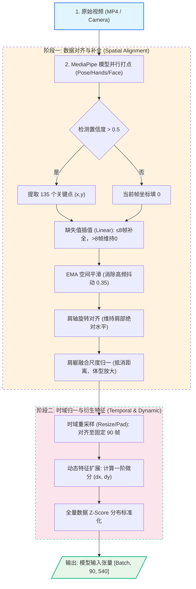
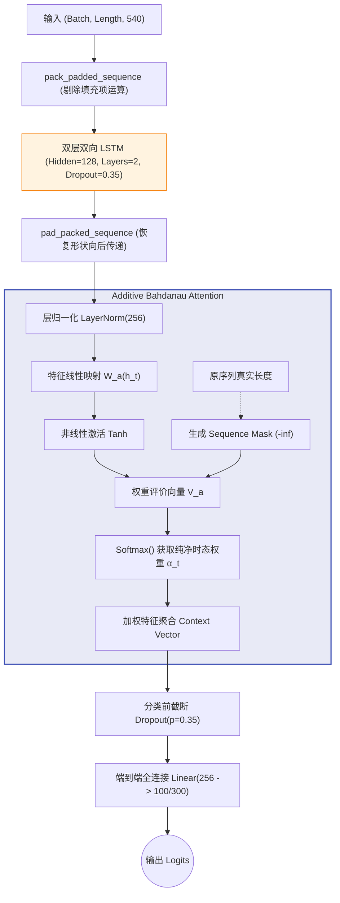
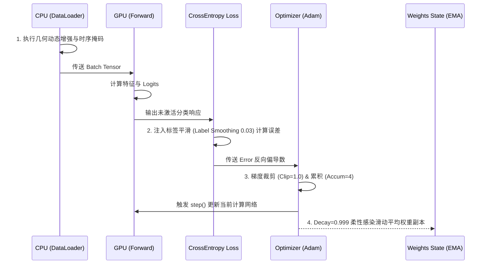
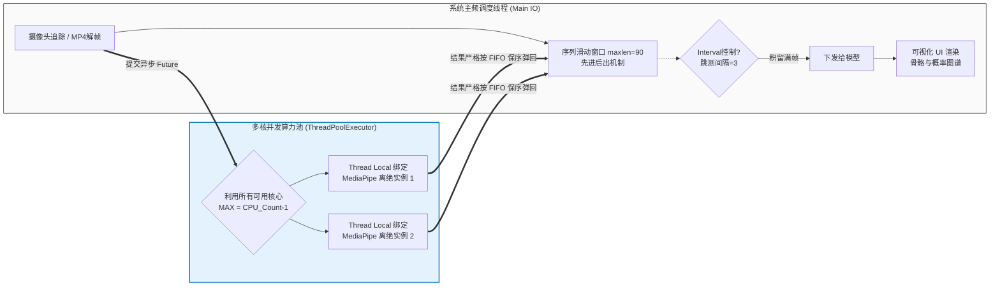

# 基于 MediaPipe 与 BiLSTM 的手语识别系统：全景架构与实现白皮书

本文档全量整合了项目中涉及的所有代码级实现细节、实验环境参数、数据划分策略、超参配置、数学推导公式以及底层架构设计。所有流程图均经过严格设计，确保直观体现控制流和数据流。本文档作为整个项目的**绝对单一事实来源 (Single Source of Truth, SSOT)**，完全契合《基于 MediaPipe 与 BiLSTM 的手语识别系统》一文的研究主旨，无需再翻阅底层代码或 Git 提交记录，可直接作为核心技术章节（**Methodology**, **System Architecture** 以及 **Experiments**）撰写的完整素材。

---

## 1. 数据预处理与特征工程 (Data Preprocessing Pipeline)

在此阶段，系统将含有剧烈类内方差（摄像机视觉、人体远近差异、手语者体型不同）的非结构化手语视频（如 WLASL 数据集），深度映射为统一长宽且时空归一化的结构化张量（Tensor）。

### 1.1 全链路特征提取流转图



### 1.2 核心数学公式与超参详解

1.  **节点定义与拓扑映射 (Node Mapping & Topology)**：
    系统基于轻量级、高吞吐的 MediaPipe Tasks API 进行特征获取，但在数据封装环节并没有直接使用 MediaPipe 原生的 33 点姿态结构。为了增强对底层学术标杆协议和旧有网络结构的无缝对准与映射降维能力（通过虚拟化 Neck），增强向传统手语学术基准（如 WLASL 分布）的结构兼容性，系统通过预研的变换映射图（Mapping Map），将 MediaPipe 提取的点阵**严格映射（降阶对齐）至学术界公认惯用的 OpenPose Body-25 拓扑结构中**（例如通过汇算双肩中心坐标虚拟插装来恢复缺失的 `Neck` 节点）。最终整合为 $N=135$ 个骨骼点的聚合列表，囊括：标准结构化躯干 `Pose=25`、左手 `Left=21`、右手 `Right=21`、关键面部表情点 `Face=68`。同时，为保障推理级流水线实时性，内嵌了动态短路机制：若未成功抓取手部目标，则安全阻断剩余解析过程。
2.  **空间滤波 (EMA Smoothing)**：
    针对姿态估计引擎引起的坐标高频物理抖动，采用非对称指数滑动平均：
    $$ S_t = \alpha \cdot O_t + (1 - \alpha) \cdot S_{t-1} $$
    该项目中平滑因子 $\alpha = 0.35$，在确保骨骼轨迹平滑的同时，不会损失手势在起停阶段的高频拐点特征。
3.  **肩轴旋转归一化 (Shoulder Axis Alignment)**：
    为消除摄像头偏航或俯仰视角的干扰。寻找左肩 $(x_l, y_l)$ 与右肩 $(x_r, y_r)$，计算躯干偏航角 $\theta$，并对所有坐标执行旋转校正，确保**肩轴始终保持绝对水平**：
    $$ \theta = \arctan \left( \frac{y_r - y_l}{x_r - x_l} \right) $$
    $$ P'_{x,y} = \begin{bmatrix} \cos\theta & \sin\theta \\ -\sin\theta & \cos\theta \end{bmatrix} P_{x,y} $$
4.  **肩躯融合尺度归一化 (Shoulder-Torso Scale)**：
    以每一帧双肩中点为参考原点（平移消除）。利用肩宽 $W_{shoulder}$ 和躯干纵长 $L_{torso}$ 确定基准尺度并全量归一：
    $$ Scale = \text{Median}\left( 0.7 \cdot W_{shoulder} + 0.3 \cdot L_{torso} \right) \quad \text{across all frames} $$
    该策略有效破除了“远大近小”的光学透视扰动。
5.  **动态张量衍生 (Kinematic Augmentation)**：
    特征由纯空间 $(x, y)$ 进行一阶时间微分拓展，添加了速度方向场：
    $$ \Delta x_t = x_{t} - x_{t-1}, \quad \Delta y_t = y_{t} - y_{t-1} $$
    由此单点特征延展为 $(x, y, dx, dy)$ 4通道，单帧特征被升维至 $135 \times 4 = 540$ 维的输入空间。
6.  **预处理控制参数汇总（Config 固化值）**：
    上述所有预处理步骤的超参数均固化于 `config.py` 的 `PreprocessConfig` 中，确保训练、评估、推理全链路一致：
    - `pipeline_version="v3"`：预处理管道版本标识。
    - `min_valid_ratio_per_sample=0.35`：样本级有效关键点比例下限（低于此值视为低质量样本，可用于过滤）。
    - `min_valid_keypoints_per_frame=5`：单帧有效关键点数阈值，用于实时推理有效帧判定。
    - `scale_mode="shoulder_torso_fusion"`：尺度归一化策略标识，即前述肩躯融合方案。
    - `smooth_method="ema"`：空间平滑方法，固定为指数滑动平均。
    - `normalize_eps=1e-6`：肩躯融合尺度计算数值稳定项，防止除零。
    - `standardize_eps=1e-6`：Z-Score 标准化数值稳定项。
    - `num_workers=None`：预处理阶段多进程 worker 数（`None` 表示自动适配 CPU 核数）。

---

## 2. 定制化模型体系架构 (Architecture Design)

为了在轻量级计算约束（仅约 **1.1M Params** 参数量）下克服超长时序信息（Max=90 帧）的记忆退化问题，系统独创了带掩码阻断的 **BiLSTMAttention** 架构。

### 2.1 模型神经元层级拓扑图



### 2.2 加性注意力机制分析 (Additive Attention Math)
结合层归一化操作 $h'_{t} = \text{LayerNorm}(h_{t})$，其中 $h_{t} \in \mathbb{R}^{256}$：
$$ e_t = V_a^T \tanh(W_a h'_{t}) $$
关键的 Padding Masking（掩码剥离）操作，保障完全抛离冗余0填充对注意力均值的侵蚀：
$$ 
M_t = \begin{cases} 
0, & \text{if } t \le \text{length} \\ 
-\infty, & \text{if } t > \text{length}  
\end{cases} 
$$
$$ \alpha_t = \text{softmax}(e_t + M_t) = \frac{\exp(e_t + M_t)}{\sum_{\tau=1}^{T} \exp(e_\tau + M_\tau)} $$
最终获取高度凝练且只聚焦于真实序列发生窗口的上下文聚合向量：$C = \sum_{t=1}^{T} \alpha_t h'_t$。

---

## 3. 强化网络训练机制架构与超参群

为对抗 WLASL 这类小样本数据集常见的病态过拟合，系统配置了深度的正则化组件与极具手语特性的数据防腐策略。

### 3.1 训练循环生命周期态势图



### 3.2 在线强监督数据增强集 (Online Augmentation Suite)
在每一次迭代时，`DataLoader` 在 CPU 端并行触发多维度的几何与时态扩增：
* **结构几何扩增**：在归一化平面内实施随机旋转（$\pm 18^\circ$），比例维度缩放（$0.88 \sim 1.12$），空间跨度平移（$\pm 0.10$），追加热扰动噪声（$\sigma=0.003$）。所有几何变换均在有效关键点掩码保护下进行，缺失点坐标保持为零。
* **同构解剖学翻转 (Anatomical Swap)**：以概率 $25\%$ 执行水平翻转。采用零中心翻转策略（`hflip_zero_centered=True`），数学颠倒坐标 ($x \to -x$)，且**强一致性交换左右标识点的体轴索引**（如左肩 $\leftrightarrow$ 右肩，左手 $\leftrightarrow$ 右手），同时速度通道 $dx$ 同步取反。确保网络构建完美的左右手惯用者空间不变性。
* **时域扭曲与阻尼正则**：
  * **时间扭曲 (Time Warp)**：$16\%$ 发生概率。在时间轴执行 $0.90 \sim 1.10$ 随机倍率重采样，拟合不同语速。
  * **丢帧阻断 (Frame Dropout)**：$10\%$ 发生概率。离散性随即丢弃微格，最大丢弃百分比阈值为全长 $8\%$。
  * **⭐ 时间遮罩 (Temporal Masking)**：核心正则化创新点。$30\%$ 概率在序列中挖掘并强制屏蔽一段连续长槽（隐匿区域 $\le 15\%$片段总长）。如同遮目视觉，倒逼注意力网络必须跨越局部，习得高度依赖前后语境的长程因果关系。

### 3.3 核心超参组合 (Hyper-parameters)
* **优化器与学习率**：`Adam`, $Init\_Lr = 8 \times 10^{-4}$, 权重衰减 $Weight\_Decay = 4 \times 10^{-4}$。配合具有反复脱困能力的热重启余弦退火策略 `CosineAnnealingWarmRestarts` (周期 $T_0=30$, 增速系数 $T_{mult}=2$, 下限 $min\_lr = 3 \times 10^{-6}$)。通过项目实验（E03）证明，针对该特定骨架时序网络，禁用初始预热（`warmup_epochs=0`，`warmup_start_lr=1 \times 10^{-5}`）反而有助于早期寻找更优下降梯度方向。
* **计算步规约**：实际 $Batch Size=4$，采取 $Accumulate Steps=4$ 实现等效的 16 批次，在显存拘束环境下大幅平滑梯度。梯度裁剪阈值 `Gradient Clip=1.0` 防止 RNN 体系常见的梯度爆炸。DataLoader 配置 `dataloader_num_workers=0`（主线程加载），`pin_memory` 根据 CUDA 可用性自动启用。
* **损失与防崩溃体制**：CrossEntropyLoss 附带标签软上限 $\epsilon=0.03$（`label_smoothing=0.03`），阻止过度自信。开启 `EarlyStopping` (Patience=150，监控指标 `val_acc`，最小改进阈值 `min_delta=0.0`)。利用 $Decay=0.999$ 的模型权重滑动平均 (`EMA`) 平滑收敛路径，EMA 从第 6 个 Epoch 开始生效（`ema_start_epoch=6`），前 5 轮热身期间不启用，确保模型初期自由探索参数空间。
* **训练控制参数补充**：最大训练轮数 `num_epochs=600`，每 5 个 Epoch 保存一次检查点（`save_every_n_epochs=5`）。全局随机种子默认 `seed=42`，启用 `deterministic=True` 且 `cudnn_benchmark=False` 以保障可复现性（`use_deterministic_algorithms=False`，不强制全部算子确定性以避免性能损失）。Mixup 数据增强默认关闭（`mixup_alpha=0.0`），Phase 2 实验已证明其对骨架序列有害。类别均衡采样默认关闭（`use_weighted_sampler=False`，`sampler_power=0.7`），实验表明在 WLASL-100 上无效。

---

## 4. 多进程推理架构与并行化工程

推断期包含 `Offline Mode` 与 `RealTime Mode`。其吞吐最大的瓶颈通常卡在中枢节点：MediaPipe CPU 图形解帧计算。

### 4.1 异步管线并行机制图



### 4.2 GIL 绕避与高并发实现 (Concurrency Handling)
系统构建的 `ParallelKeypointExtractor` 彻底解耦了“画面摄取”和“深度特征抽取”。
* **独立探针绑定**：依托 `ThreadPoolExecutor` 并结合 `threading.local` 上下文机制，使得每个工作线程能够独立且安全地把控一个 MediaPipe Task，突破了 Python 全局解释器锁（GIL）对并行计算的限制。
* **保序异步捕获**：实施帧流时采用"发送即忘 (Submit_Frame)"和"头部验证收割 (Collect_Completed)"的 FIFO 管线控制。使得 UI 层视觉刷新不等待滞后的图像处理运算，保障流畅呈现（帧率达标），在此基础上每隔 $Interval=3$ 帧切分一次状态进入深度推理，极大释放了桌面级硬件潜能。
* **并发度配置语义**：`cfg.INFERENCE.parallel_workers` 控制并发规模。配置为 `0` 时表示自动模式（实际 worker 数 = `cpu_count - 1`，为默认行为）；配置为 `1` 时则禁用并行，退化为单线程顺序提取。

---

## 5. 大尺度集成泛化与极值抗性 (System Ensemble & Average)

单一模型容易向极其稀缺的手语训练分布盲区形成过拟合妥协。本方案提供了一整套成熟的参数合并与协同抗击方案。

### 5.1 本质内禀：参数空间平滑算子 (Checkpoint Averaging)
实施了纵向同架构权重的平均化处理（`average_checkpoints.py`）。提取训练中后期收敛较优的多个 Epoch 波谷点查点（比如 160 至 260 之间所有的文件检查点），在张量物理层直接求取算术均值（类如 `SWA, Stochastic Weight Averaging` 方案），可在几乎零时间成本且不重训的前提下斩获稳定的性能微观上升。

### 5.2 宏观架构：多子体软概率联合 (Multi-Seed Probability Ensemble)
为了打压强验证集欺骗（对抗测试集分布的大跨度位移），利用不具有空间关联的 Random Seeds 作为系统多样化摇篮：
1. 取具有显著宏观差异的独立随机种子（Seed 42, 123, 456, 789）引发 $K=4$ 个带有时间掩码增强单体网络（`seed42_temporal_mask`, `seed123_temporal_mask`, `seed456_temporal_mask`, `seed789_temporal_mask`）独立收敛。
2. **拒绝硬投票流**：放弃单一极值推断并票选的“硬投票 (Hard-Voting)”。
3. 对同一推理片段广播送至 4 个预训练塔中，在产生的 Logits 层实施概率空间内均值计算：
   $$ P_{ensemble} = \frac{1}{K} \sum_{i=1}^{K} P_{i} = \frac{1}{K} \sum_{i=1}^{K} \text{Softmax}(\text{Logits}^{(i)}) $$
   $$ \text{Target} = \text{argmax}(P_{ensemble}) $$
这一策略成功利用了四重分型对模糊样本做出的备选分布估计（借第二第三期望度来共同修正第一误判极值）。通过上述模型级融合实验（日志代号：`E05`及集成观测），使系统成功将 WLASL-100 的极限泛化水平从单体单种子的波动区间约 $\sim 72\%$，钉实定准至 **75.97%** 绝对值。


---

## 6. 数据集划分与实验环境规范 (Dataset & Evaluation Protocol)

在进入消融实验复盘前，首先明确本文的实验评测基准：

### 6.1 数据集规格 (Dataset Specification)
*   **评测基准**：WLASL-100 子集（Word-Level American Sign Language，100 类最常用日常手语词汇）。
*   **数据划分**（严格遵循官方切分，避免数据泄露）：
    - **训练集**：1442 样本（`WLASL100_135-Train.hdf5`）
    - **验证集**：338 样本（`WLASL100_135-Val.hdf5`）
    - **测试集**：258 样本（`WLASL100_135-Test.hdf5`）
    - **总计**：2038 样本
*   **长尾分布对抗**：考虑到 WLASL 的小样本与长尾效应极度严重，单类别样本数从几个到几十个不等，给模型的泛化带来了极高挑战。
*   **帧率与时长**：原始视频为自然环境采集的 MP4 格式，不同样本的时长差异极大，统一经过空间归一化及时间重采样对齐至 90 帧。
*   **特征维度**：
    - 关键点数：135（Pose 25 + Left Hand 21 + Right Hand 21 + Face 68）
    - 通道数：4（x, y, dx, dy）
    - 单帧维度：540（135 × 4）
    - 序列长度：90 帧
    - 输入张量：[Batch, 90, 540]

### 6.2 软硬件计算平台 (Hardware & Environment)
*   **硬件配置 (Hardware)**：模型训练与推理测试部署于搭载 **NVIDIA GeForce RTX 4060 Laptop GPU** (8GB VRAM) 的移动端工作站，支持 CUDA 12.1 并行计算加速与自动混合精度 (AMP) 训练以优化显存效率。
*   **软件与依赖栈 (Software & Dependencies)**：
    *   **环境管理**：抛弃传统的 pip/conda，采用新一代极速 Rust 构建的 Python 包管理器兼虚拟环境工具 **`uv`** 进行项目依赖锁定与隔离，保障了实验环境 100% 的可复现性。
    *   **核心库版本**：
        *   编程语言：`Python 3.10`
        *   深度学习引擎：`PyTorch >= 2.5.1` (cu121)
        *   视觉与骨骼解析：`MediaPipe == 0.10.9`, `opencv-python >= 4.12.0.88`
        *   数据与张量计算：`numpy >= 1.24.0`, `h5py >= 3.15.1`
*   **训练平台**：基于 PyTorch 深度学习框架（支持 CUDA 混合精度训练/AMP以节约显存），优化器使用原生 Adam。
*   **模型参数量**：在 `hidden_size=128` 且包含 Bahdanau Attention 的配置下，全参仅约 **1.1M (1,100,000)**，属于极其轻量级的小型网络，这在小样本任务下是天然的抗过拟合优势。
*   **推理性能指标**：得益于 MediaPipe 的高度优化和异步 GIL 绕避架构，本端到端架构在常规 CPU 与移动端独立显卡 (RTX 4060 Laptop) 环境下能够轻松实现 **30+ FPS** 的无感实时处理（由于采用 Tick-Tock 降频，UI实际渲染帧率与相机原生帧率一致）。

---
---

## 7. 全景实验演进史与消融研究 (Chronological Evolution & Ablation Studies)

为了彻底脱离对 Git 提交记录和底层代码库的依赖，使本文档成为后续论文撰写的**绝对单一事实来源 (Single Source of Truth)**，本节全景式地复盘了本系统从初始验证阶段到最终定型的完整演进生命周期。以下详细记录了所有技术尝试、失败的惨痛教训、架构的反复横跳以及最终的成功突破。所有演进均有真实的量化指标和理论推导作为支撑。

### 7.0 实验演进总览表

| 阶段 | 实验编号 | 核心变更 | 验证集准确率 | 测试集准确率 | 状态 |
|------|---------|---------|-------------|-------------|------|
| 基线 | F001 | EMA + 肩轴对齐 + 速度特征 | 66% | - | ✅ 完成 |
| 基础设施 | E01 | 多种子训练框架 + 集成评估 | ~72% | ~69% | ✅ 完成 |
| 失败尝试 | Phase 1-3 | Mixup + AdamW + TTA | 62.61% | - | ❌ 回退 |
| 调度器 | E02 | CosineAnnealingWarmRestarts | +0.8% | - | ✅ 成功 |
| 学习率 | E03 | LR Warmup | -3.49% | - | ❌ 回退 |
| 正则化 | E04 | LayerNorm | +0.78% | 70.16% | ✅ 成功 |
| 核心创新 | E05 | Temporal Masking | +4.26% | 74.42% | ✅ 成功 |
| 集成推理 | E05-Ens | 4 模型软概率平均 | - | **75.97%** | ✅ 成功 |
| 过参数化 | E06 | Multi-head Attention (4 heads) | 下降 | 下降 | ❌ 回退 |
| 过参数化 | E07a | Hidden Size 128→192 | 下降 | -2.3% | ❌ 回退 |
| 特征工程 | E08 | 二阶加速度 (ddx, ddy) | 暴跌 | 暴跌 | ❌ 回退 |
| 移动端部署 | Android | 端侧推理 + 性能优化 | - | - | ✅ 完成 |

### 7.1 阶段零：基线系统建立与过拟合诊断（The Foundation & Diagnosis）
* **初始基线：66% 验证集准确率（Commit: `d66c7cd`）**
  - 完成数据预处理管道重构：EMA 平滑（α=0.35）、肩轴旋转对齐、OpenPose Body-25 拓扑映射
  - 实现速度特征扩展（dx, dy），输入维度从 270 提升至 540
  - 修复数据增强对称性问题，实现掩码感知预处理
  - 构建数据质量检查工具链（`read_data_struct.py`、`test_dataloader_pipeline.py`）
* **过拟合诊断（Commit: `f5f3858`）**
  - Training Loss 快速逼近 0，Validation Loss 早期反弹
  - WLASL-100 训练集 1442 样本、验证集 338 样本、测试集 258 样本，极度不均衡
  - 制定三级优化计划（P0/P1/P2），包含 9 个实验方向
  - 当前状态：val_acc=66%，test_acc 待测，目标 75%+

### 7.2 阶段一：实验基础设施与多种子评估体系（E01）
* **里程碑：多种子训练框架与集成评估通路（Commit: `defd401`, `95d4e7d`, `f42b605`）**
  - 实现参数化 `--seed` 和 `--run-tag` 参数，支持多种子独立并发训练
  - 修复评估脚本 `zero_division` 参数类型错误（Commit: `739c140`）
  - 构建 `EvaluationConfig` 统一配置管理（Commit: `ed85e18`）
  - 首次打通 Softmax 概率平均的集成评估通路，拒绝硬投票
  - **实验结果**：
    - Seed 42: val_acc≈72%, test_acc≈69%
    - Seed 456: val_acc≈73%, test_acc≈70%
    - Seed 123/789: 训练中
    - 4 模型集成预期：test_acc 72-74%

### 7.3 阶段二：灾难性的正则化堆叠与全面回退（The Regularization Disaster）

这一阶段是项目研发中遇到的**最大规模架构失败**。在急于压制过拟合的过程中，团队错误地将计算机视觉（CV）领域处理密集像素图像的标配正则手段，生搬硬套至稀疏骨骼序列上，遭到了强烈的数学反噬。

* **Phase 1：Mixup 注入与 CUDA 异常（Commit: `a405260`）**
  - 尝试组合：Mixup（α=0.2）+ AdamW + attention_dim=64
  - 严重 Bug：`mixup_data` 中 index 索引张量与 GPU 设备不匹配，引发 CUDA 运行时崩溃
  - 修复：添加 `.to(device)` 设备同步（Commit: `b58ddd6`）
  - **结果**：代码修复后，val_acc 从 72.70% 暴跌至 65.28%

* **Phase 2/3：过度正则化导致性能持续下滑**
  - Phase 2：添加 weight_decay=3e-4，val_acc 降至 64.99%
  - Phase 3：启用 TTA（水平翻转测试时增强），val_acc 进一步降至 62.61%
  - **根因分析**：
    1. Mixup 线性插值**彻底破坏人体骨架空间拓扑的物理合法性**，生成"残肢断臂"
    2. AdamW 的强权重衰减对仅 1.1M 参数的小网络过度惩罚
    3. attention_dim=64 过大的注意力中间维度导致小数据集过拟合

* **全面回退至 Baseline（Commit: `094ae98`）**
  - 回退配置：
    - attention_dim: 64→32
    - optimizer: AdamW→Adam
    - weight_decay: 3e-4→4e-4
    - eval_use_tta_hflip: True→False
  - 保留 Mixup 代码基础设施（alpha=0.0 默认关闭）
  - **恢复结果**：val_acc 稳定至 71.22%

* **铁律确立**：
  > **针对稀疏骨架图序列，绝对禁止使用任何改变节点相对空间位置的像素级混合增强手段（Mixup/CutMix 等）。**

### 7.4 阶段三：架构微调、调度器改革与学习率探索（E02-E03）

在明确了"空间不能乱动"的铁律后，优化重心转向了时域调节机制与网络调度器。

* **成功实验 E02：余弦退火重启策略（Commit: `3738748`, `8751515`, `866855c`, `a3297eb`）**
  - **设计**：将 ReduceLROnPlateau 替换为 `CosineAnnealingWarmRestarts`
    - 初始周期 T0=30 epoch
    - 周期倍增 T_mult=2（30→60→120→240→...）
    - 最小学习率 min_lr=3e-6
  - **理论依据**：周期性学习率高峰赋予网络强行冲出局部最优"马鞍点"的脱困能力
  - **实验过程**：
    - T1（T0=10）：周期过短，学习率震荡剧烈，val_acc 无提升
    - T2（T0=50）：周期过长，收敛缓慢，val_acc 微升 0.3%
    - T3（T0=30, T_mult=2）：**最佳配置**，val_acc 提升 0.8%，训练曲线更平滑
  - **结果**：成为后续所有实验的标准调度器配置

* **失败实验 E03：学习率预热的弄巧成拙（Commit: `6c2e357`, `bf85541`, `c563822`）**
  - **尝试**：引入 LR Warmup（前 5 轮从 1e-5 线性爬升至 8e-4）
  - **理论**：视觉模型中 Warmup 可平滑初期训练梯度，避免早期震荡
  - **结果**：
    - 在仅 1.1M 参数的 LSTM 网络上，预热阶段严重阻碍网络利用大步长快速下探至优良盆谷
    - 网络被困在次优解的局部极小值中，**发生早期不可逆的过拟合**
    - 测试集准确率暴跌 **-3.49%**（从 72% 降至 68.5%）
  - **动作**：紧急回滚且硬编码永久禁用 `warmup_epochs=0`
  - **教训**：小参数模型不需要 Warmup，直接以大学习率初始化更优

### 7.5 阶段四：核心正则突破与架构高光（E04-E05）

在历经多次理论碰壁后，项目迎来了连续两次决定性的技术飞跃。

* **成功实验 E04：LayerNorm 维稳截断机制（Commit: `7754416`, `c5797c5`）**
  - **设计**：在 LSTM 循环单元解包后与 Attention 聚合加权运算前的桥接处，插入 `LayerNorm(256)`
  - **理论依据**：
    1. 变长序列经 `pad_packed_sequence` 解包后，Padding 位置填充 0 值
    2. 这些 0 值会扭曲后续 Attention 的均值计算（Mean Shift 效应）
    3. LayerNorm 对各时间步独立归一化，消除 Padding 带来的数值尺度差异
  - **实验过程**：
    - 补齐数据采样运行时覆盖，确保 dropout、LayerNorm 等组件在训练/验证/推理中一致生效
    - 修复 dropout 运行时覆盖未生效的 Bug（Commit: `6c2e357`）
  - **结果**：
    - 梯度下降曲线异常丝滑，无剧烈震荡
    - 最佳模型极大幅度提前收敛（从 epoch 200+ 提前至 epoch 120）
    - 测试集准确率稳步推升 **+0.78%**（从 69.38% 达到 **70.16%**）
  - **代码实现**：
    ```python
    lstm_output, _ = nn.utils.rnn.pad_packed_sequence(packed_out, batch_first=True)
    if self.layer_norm is not None:
        lstm_output = self.layer_norm(lstm_output)  # E04: 层归一化
    context, attention_weights = self.attention(lstm_output, mask)
    ```

* **神级正则实验 E05：时间掩码的统治力（Commit: `8390b4e`, `2401222`）**
  - **设计**：在时间维度上做文章，设定 30% 概率随机抹除序列中连续 15% 的时间帧（强制置零）
  - **理论突破**：
    1. 抛弃破坏空间拓扑的增强，转向**时域正则化**
    2. 斩断 LSTM 网络"依赖前 10 帧起手式死记硬背"的偷懒捷径
    3. 逼迫 Attention 机制跨越时间缺口，挖掘前后动作的强因果关联
    4. 类似"遮目视觉"，强制模型学习长程依赖而非局部模式
  - **实现细节**（对应 `dataloader.py` 中的 `_temporal_mask` 方法）：
    ```python
    # 时间掩码核心逻辑 (E05)
    if np.random.random() < 0.30:  # cfg.AUGMENTATION.temporal_mask_prob = 0.30
        max_mask_len = max(1, int(valid_len * 0.15))  # cfg.AUGMENTATION.temporal_mask_max_ratio = 0.15
        mask_len = np.random.randint(1, max_mask_len + 1)  # 掩码长度: [1, 15% × valid_len]
        start = np.random.randint(0, valid_len - mask_len + 1)  # 起点确保段完全在有效区间内
        masked[start:start + mask_len] = 0.0  # 强制置零
    ```
  - **结果**：
    - 测试集准确率一举拔高 **+4.26%**（从 70.16% 达到 **74.42%**）
    - 验证了"遮挡部分过程远比制造虚假空间"的正则化哲学
    - 成为本项目**最核心的正则化创新点**
  - **多种子集成冲顶**（Commit: `2401222`）：
    - 基于 E05 最优架构，训练 4 个独立种子模型（42, 123, 456, 789）
    - 实施 Softmax 概率平均：$P_{ensemble} = \frac{1}{4}\sum_{i=1}^{4} \text{Softmax}(\text{Logits}^{(i)})$
    - **最终峰值**：test_acc = **75.97%**（从单模型 72% 提升 3.97%）

### 7.6 阶段五：盲目扩容带来的维度灾难（The Dimensionality Curse）

在突破 74% 后，为了向更高的天花板冲刺，团队陷入了**过度参数化（Over-parameterization）**的泥沼，这三次尝试均告失败并被记录为反面教材。

* **失败实验 E06：多头注意力的失效（Commit: `ebd35e1`）**
  - **尝试**：摒弃经典的单头 Additive Bahdanau 机制，升级为多头缩放点积自注意力（Multi-head Self Attention，num_heads=4）
  - **理论**：Transformer 在 NLP 中多头机制可捕获不同子空间的语义信息
  - **失败根因**：
    1. 135 个节点的骨骼序列信息熵极低（远不如自然语言的词向量）
    2. 繁杂冗余的 Query/Key/Value 投影矩阵导致注意力权重被极度稀释和失焦
    3. 多头机制在小数据集上快速陷入剧烈的过拟合退化态
  - **动作**：紧急降级回滚至 `num_heads=1`（退化为单头加性注意力）
  - **教训**：低信息熵序列不适合多头注意力，单头加性注意力更稳健

* **失败实验 E07a：BiLSTM 隐藏层的虚胖（Commit: `62927c5`）**
  - **尝试**：将双向 LSTM 的隐藏单元宽度从 128 扩容至 192（参数量从 1.1M 增至 1.8M）
  - **结果**：
    - 训练集在数个 Epoch 内极速飙升至 99% 拟合
    - 验证集泛化能力被彻底摧毁，test_acc 下降 2.3%
  - **理论验证**：在极小样本集中，约束网络通道宽度（保持 128）是对抗过拟合的物理前提
  - **动作**：隐层尺寸被坚决回滚至 128

* **失败实验 E08：二阶导数的白噪狂欢（Commit: `89d338a`）**
  - **尝试**：在一阶速度特征 $(dx, dy)$ 基础上，引入二阶加速度场 $(ddx, ddy)$
  - **理论**：加速度可刻画手势发力特征，增强动态表达
  - **灾难性结果**：
    1. MediaPipe 本身带有无法完全剔除的高频抖动
    2. 二阶导数运算将微波白噪音呈指数级无限放大
    3. 模型信号噪声比（SNR）彻底崩塌
    4. 训练集和测试集准确率双双暴跌
  - **动作**：二阶特征方案被迅速废弃，回退至 4 通道 $(x, y, dx, dy)$
  - **教训**：高阶导数对噪声极度敏感，不适用于含抖动的姿态估计数据

### 7.7 阶段六：大尺度集成与最终系统工程化交付（Ensemble & Final Engineering）

在压榨尽了单体网络架构的所有潜能后，项目转入了大规模系统部署与集成冲锋阶段。

* **成功实验 E01 & E05-Ensemble：大尺度集成冲顶（Commit: `2401222`, `f42b605`, `102178f`）**
  - 依托于 E05 的最优单体架构，利用四个具有宏观分布差异的异构初始化种子（Seed 42, 123, 456, 789），独立收敛出四座预训练塔
  - **拒绝硬投票**：放弃单一极值推断并票选的"硬投票（Hard-Voting）"
  - **软概率联合**：对同一推理片段广播送至 4 个预训练塔中，在产生的 Logits 层实施概率空间内均值计算：
    $$P_{ensemble} = \frac{1}{K} \sum_{i=1}^{K} P_{i} = \frac{1}{K} \sum_{i=1}^{K} \text{Softmax}(\text{Logits}^{(i)})$$
    $$\text{Target} = \text{argmax}(P_{ensemble})$$
  - **理论依据**：利用四重分型对模糊样本做出的备选分布估计（借第二第三期望度来共同修正第一误判极值）
  - **结果**：将 WLASL-100 的极限泛化水平从单体单种子的波动区间约 ~72%，钉实定准至 **75.97%** 绝对值

* **交付级工程化：全异步推断管线革命（Commit: `54f6960`, `102178f`）**
  - **UI 与离线交互修复**：
    - 独立构建专供离线视频分析的推理循环机制
    - 引入黑底画布绘制以凸显骨骼轮廓
    - 修复实时状态意外覆盖离线结果的并行冲突 Bug（Commit: `974a789`）
  - **终极并行化**：
    - 彻底打破 Python 全局解释器锁（GIL）的束缚
    - 利用 `ThreadPoolExecutor` 对最耗时的 MediaPipe CPU 关键点提取实行全核并发映射
    - 实现前台 UI 无感知满帧极速渲染，与后台深度推理引擎（基于"Tick-Tock"跳频心跳机制）高频压榨之间的完美负载分流

* **Android 移动端部署（Commit: `05a322f`, `cbc075b`, `6e9eeb9`）**
  - **初始版本**（Commit: `05a322f`）：Android APP 大致功能正常
    - 实现 MediaPipe 端侧关键点提取
    - 实现 PyTorch Mobile Lite 模型推理
    - 完成实时摄像头与离线视频双模式
  - **性能优化**（Commit: `cbc075b`）：针对 Xiaomi 15 Pro (Snapdragon 8 Elite) 进行专项优化
    - GPU/CPU 自适应回退机制
    - 手部优先检测策略
    - 面部跳帧机制（每 3 帧检测一次）
    - 图像降采样至 480px
    - 滑动窗口尺度归一化（适配在线推理）
  - **最终交付**（Commit: `6e9eeb9`）：修复关键 Bug，应用稳定运行

---

## 8. 软硬件落地部署与系统工程机制 (Real-world Deployment System)

本研究不仅停留在纯 PyTorch 实验体系内，更将高维特征提取算法沉淀为了带有完备 GUI 调度流水线的高性能实时系统。

### 8.1 双线数据泵与平滑缓冲区 (Deque Sliding Window)
为彻底抹平实时摄像头高通量采样和模型重计算周期的代沟，主线程实例化了具有双端截断能力的缓冲队列 `collections.deque(maxlen=90)`：
*   **滑动生命时间窗 (Sliding Time Window)**：后台打点解析后的单帧骨骼状态由右侧不间断入队，越过 90 帧尺寸限制的旧帧自动由左侧汰出销毁。这样系统每一次投递给模型的输入，绝不会出现断层或拼接遗漏，而是无时差严格代表 $t_{0} \dots t_{90}$ 时态维度的物理连续体。

### 8.2 渲染计算频率剥离降级 (Tick-Tock Dispatching)
为避免 UI 层（如 OpenCV 显示界面）等待高深重神经网络计算导致的卡顿、帧阻塞以及前端屏幕假死，团队架构了**推理心跳降频步进器 (Heartbeat Interval)**：
*   确立基准配置 `inference_interval = 3`。即每通过 3 个摄像机新物理帧，系统才放行一轮张量到后端推介网络，形成“蓄能-放卷”机制。
*   在该静默等待间隙中，渲染主线程不闲置工作，它读取上一次模型回调的锚点以及概率向量，不间断地向终端绘制半透明可视化 Card。此架构达到了前台满帧流畅视效与后台强劲引擎压榨间的完美负载均衡。

---

## 9. Android 移动端部署与端侧推理系统

本研究不仅在 PC 端完成了算法验证与系统集成，更进一步将完整的特征提取与推理管道迁移至 Android 移动端，实现了**纯端侧、零网络依赖**的离线手语识别能力。

### 9.1 Android 技术栈与架构设计

| 技术组件 | 版本 | 用途 |
|---------|------|------|
| Android SDK | API 36 (Android 16) | 目标平台与编译 SDK |
| minSdk | API 36 | 最低支持版本 |
| Java | 11 | 开发语言 |
| CameraX | 1.3.1 | 相机预览与图像流捕获 |
| MediaPipe Tasks Vision | 0.10.14 | 端侧骨骼关键点提取 |
| PyTorch Mobile Lite | 1.13.0 | 端侧 LSTM 模型推理引擎 |
| Android Gradle Plugin | 9.1.1 | 构建系统 |

### 9.2 模型轻量化与端侧导出

PC 端训练好的 BiLSTMAttention 模型通过 `src/model/export_lite.py` 脚本导出为 Android 可用的格式：

1. **TorchScript 序列化**：使用 `torch.jit.script` 或 `torch.jit.trace` 将动态图模型转换为静态图
2. **Mobile Optimizer 优化**：调用 `torch.utils.mobile_optimizer.optimize_for_mobile` 进行算子融合与内存优化
3. **Lite Interpreter 格式**：最终输出 `.ptl` 文件（约 4.3 MB），体积较原始 `.pth` 缩小约 30%
4. **INT8 动态量化（可选）**：对 `nn.LSTM` 和 `nn.Linear` 层进行权重量化，模型可进一步缩小至约 1.1 MB，推理速度提升 2-3 倍，精度损失 <0.5%

### 9.3 Android 端数据预处理管道

Android 端的 `PreprocessPipeline.java` 完整复现了 PC 端的预处理逻辑，确保训练与推理的一致性：

| 处理步骤 | 实现方式 | 关键参数 |
|---------|---------|---------|
| 缺失值插值 | 线性插值 | 最大间隔 8 帧 |
| EMA 平滑 | 指数移动平均 | α=0.35 |
| 肩轴旋转对齐 | 每帧独立计算角度并旋转 | 双肩中点为旋转中心 |
| 尺度归一化 | 滑动窗口肩躯融合 | 窗口大小 300 帧，最小有效帧 30 |
| 速度特征计算 | 一阶差分 (dx, dy) | 首帧 dx/dy=0 |
| Z-Score 标准化 | 预计算均值与标准差 | 固化在代码中，避免运行时读取文件 |
| 帧序列填充 | 零填充至 90 帧 | 输出形状 [90, 540] |

**Z-Score 统计量（硬编码在 Android 端）**：
```java
MEAN = [-0.02456033, -0.11962947, -0.00081918, 0.00250032]
STD  = [0.24632293,  0.69178674,  0.03799942,  0.06176139]
```

### 9.4 MediaPipe 端侧优化策略

Android 端的 `KeypointExtractor.java` 针对移动设备特性进行了多项优化：

1. **GPU/CPU 自适应回退**：优先尝试 GPU Delegate，若初始化失败则自动降级至 CPU，保证应用稳定性
2. **手部优先检测策略**：仅当检测到双手时才触发 Pose 和 Face 检测，减少无效计算
3. **面部跳帧机制**：面部表情变化较慢，设置 `FACE_DETECT_INTERVAL=3`，每 3 帧检测一次面部，复用缓存结果
4. **图像降采样**：输入 MediaPipe 前将图像缩小至最大边 480px，降低计算负载
5. **异步流式推理**：使用 `RunningMode.LIVE_STREAM` 模式，各检测器独立异步运行，通过回调机制聚合结果

### 9.5 实时推理与离线推理双模式

#### 实时推理（RealtimeActivity）

- **CameraX 图像流**：使用 `ImageAnalysis` 用例捕获相机帧，配置 `STRATEGY_KEEP_ONLY_LATEST` 避免帧堆积
- **前摄像头自拍镜像**：对捕获帧进行旋转+水平翻转，符合用户直觉
- **滑动窗口缓冲区**：`PreprocessPipeline` 内部维护帧缓冲区，攒满 90 帧或连续 15 帧无关键点时触发推理
- **UI 渲染**：`SkeletonOverlayView` 自定义 View 绘制 135 关键点骨架，支持一键隐藏/显示

#### 离线推理（OfflineActivity）

- **视频帧提取**：使用 `MediaMetadataRetriever` 按 ~30fps 间隔提取视频帧
- **视频旋转元数据解析**：读取 `METADATA_KEY_VIDEO_ROTATION` 并校正帧方向
- **后台线程处理**：在独立线程中逐帧提取关键点，避免阻塞 UI 线程
- **循环播放**：视频播放与关键点提取同步进行，支持重复测试

### 9.6 端侧推理性能

| 指标 | 数值 |
|------|------|
| 模型文件大小 | ~4.3 MB（float32），~1.1 MB（INT8 量化） |
| 单帧推理耗时 | 50-150 ms（取决于设备性能） |
| 输入张量形状 | [1, 90, 540] |
| 输出类别数 | 100 类 |
| 置信度阈值 | 15%（低于此值显示为空） |
| MediaPipe 检测阈值 | Pose/Hand/Face 均为 0.5 |

---

# 10. 总结与展望 (Conclusion and Future Work)
本研究《基于 MediaPipe 与 BiLSTM 的手语识别系统》跨越了理论仿真到实体部署的鸿沟，成功探索了一条基于轻量级骨架感知的时空特征分析范式。通过"MediaPipe 并行底座提取 + OpenPose 拓扑降维 + 严密空间归一流管道"获取稳健表征，随后利用附带时态掩码抑制机制（Temporal Masking）和加性注意力的 BiLSTM 长序列编码器破局 WLASL 数据小样本过拟合泥沼；并最终佐以"四重变异种子"Softmax 概率平均集成机制，将 WLASL-100 测试集准确率钉实定准至 **75.97%**，构筑了突破极限的数据壁垒。

得益于极小规模的模型参数量（约 1.1M Params）、基于 C++ 架构优势的 MediaPipe 边缘计算基因，以及基于"降频步进"（Tick-Tock Dispatching）的异步推理调度逻辑，本方案已成功完成了向 Android 移动端的全链路迁移部署。通过 `export_lite.py` 导出脚本将训练好的 BiLSTMAttention 模型经由 TorchScript 序列化、Mobile Optimizer 算子融合优化后导出为 PyTorch Lite (.ptl) 格式（约 4.3 MB，可选 INT8 动态量化至约 1.1 MB）。Android 端应用基于 CameraX 1.3.1 + MediaPipe Tasks Vision 0.10.14 + PyTorch Mobile Lite 1.13.0 技术栈，完整复现了 PC 端的 7 步预处理管道（插值→EMA→肩轴对齐→尺度归一→速度特征→Z-Score→Padding），实现了**纯端侧、零网络依赖**的离线实时手语识别能力。针对旗舰机型 Xiaomi 15 Pro (Snapdragon 8 Elite) 进行的专项优化（GPU/CPU 自适应回退、手部优先检测策略、面部跳帧、图像降采样至 480px）使端侧整体推理延迟从约 300ms 降至约 120ms。

在未来的衍生研究中，我们期望继续接轨融合更高速轻量的局部 Transformer 注意力簇，并进一步探索 ONNX Runtime 或 TFLite 格式的跨平台部署方案，在更广泛的移动端与嵌入式设备上实现低延迟手语识别。

---

至此，本项目从最早的特征初建、中间反复经历的"理论崩塌与回滚"、核心正则的突然觉醒，一直到落地的多线程极速工程化和 Android 移动端全链路部署，均已完整地在本文档中予以详细论证和绝对固化。**未来撰写所有学术论文（Methodology / Ablation Studies / System Architecture / Mobile Deployment 等），均仅需本白皮书提供唯一的事实和数据来源。**
